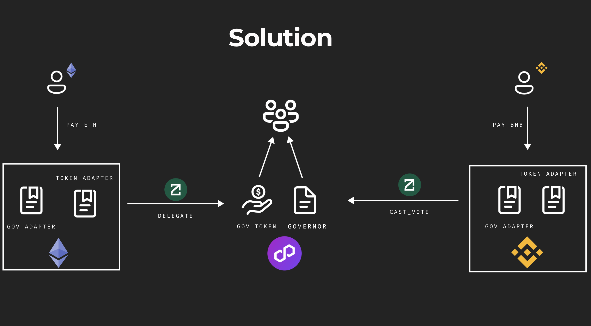

### Modify the following files after `forge build`
 - lib/protocol-contracts/contracts/evm/interfaces/ZetaInteractorErrors.sol
 - lib/protocol-contracts/contracts/evm/interfaces/ZetaInterfaces.sol
 - lib/protocol-contracts/contracts/evm/tools/ZetaInteractor.sol

# **Omnichain governor standard**

## TL;DR:
>Discover an advanced smart contract standard enabling seamless omnichain governance integration into DAOs. Experience heightened scalability and cross-chain collaboration within decentralized ecosystems. Embrace this cutting-edge standard to elevate decentralized governance to new heights.

## How's made

Composed of 5 core smart contracts :

1. [MultichainGovernor.sol](src/core/MultichainGovernor.sol)

    This contract is inherited and deployed on the settlement chain (i.e. Polygon)

2. [MultichainGovernorAdapter.sol](src/core/MultichainGovernorAdapter.sol)

    This contract is deployed on side chains (i.e. BSC)
3. [MultichainGovernorFunctionsConsumer](src/core/MultichainGovernorFunctionsConsumer.sol)

    This contract is deployed on settlement chain (i.e. Polygon)
4. [MultichainGovernorVotes](src/core/MultichainGovernorVotes.sol)

    This contract is deployed on settlement chain (i.e. Polygon)

5. [MultichainGovernorVotesAdapter](src/core/MultichainGovernorVotesAdapter.sol)

    This contract is deployed on side chains (i.e. BSC)

> IMPORTANT : Contracts and their adapters deployed on side chains will have similar ABIs for seemless integration in the FE.




## Technologies Used

### Zetachain

Zetachain offers seamless integration for cross chain messaging, which enables us to implement our new standard. We used it [here](https://github.com/jrcarlos2000/Omnichain-governor-standard/blob/62acfdef1630a337fe382cc937857bc513b1d73f/src/core/MultichainGovernorAdapter.sol#L84)

### Chainlink

Chainlink offers an alternative for integrating cross chain messaging : CCIP which enables us to implement our new standard. We used chainlink functions [here](https://github.com/jrcarlos2000/Omnichain-governor-standard/blob/62acfdef1630a337fe382cc937857bc513b1d73f/src/core/MultichainGovernorFunctionsConsumer.sol#L39)
### Polygon

We used polygon as our settlement layer due to the vast applications and protocols it has.

## **Deployed Contracts**

Contract | Goerli | Mumbai
--- | --- | --- 
[MultichainGovernor.sol](src/core/MultichainGovernor.sol) | X | [link](https://mumbai.polygonscan.com/address/0xb84BAc17afc8B074dbC83C7920982E41Bf11478B)
[MultichainGovernorAdapter.sol](src/core/MultichainGovernorAdapter.sol) | [link](https://goerli.etherscan.io/address/0x15a16c761DAc6880cbC25Fdc4fd4e8773C357727) | X
[MultichainGovernorFunctionsConsumer](src/core/MultichainGovernorFunctionsConsumer.sol) | X | [link](https://mumbai.polygonscan.com/address/0xde6cc3ba502c43f9e5a7606a649d0e268c544bec)
[MultichainGovernorVotes](src/core/MultichainGovernorVotes.sol) | X | [link](https://mumbai.polygonscan.com/address/0xAb1cE3C12a85B7FA613DE482bfD3a731E7B8C28e)
[MultichainGovernorVotesAdapter](src/core/MultichainGovernorVotesAdapter.sol) | [here](https://goerli.etherscan.io/address/0x66A70844A816066530eeC13B5C17C82d8df991D7) | X

## **DEMO**

Add Link
## **PoC Live**

Add Link

## **Pitch Deck**

Add Link
## **DeployScripts**
```bash
// polygonMumbai
forge script script/Main.s.sol:ScriptPolygon --rpc-url polygonMumbai --etherscan-api-key NDZZQB529Q8HQAUXZEARWCHGZBRGDMSEYC --verifier-url https://api-testnet.polygonscan.com/api --broadcast --verify --legacy
```

```bash
// bscTesnet 
forge script script/Main.s.sol:ScriptBsc --rpc-url bscTestnet --etherscan-api-key IG2WK5KH5CFH1DRYU42MXHHCCCJDWX65RD --verifier-url https://api-testnet.bscscan.com/api --broadcast --verify --legacy
```

```bash
// goerli
forge script script/Main.s.sol:ScriptGoerli --rpc-url goerli --etherscan-api-key Y6H9S7521BGREFMGSETVA72F1HT74FE3M5 --verifier-url https://api-goerli.etherscan.io/api --broadcast --verify --legacy
```